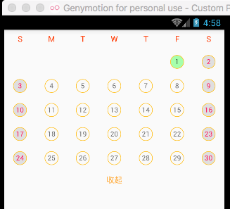

# Rn_CalendarView
[![download][download-image]][download-url]

[npm-image]:https://github.com/wisn-mirror/Rn_CalendarView
[npm-url]:https://github.com/wisn-mirror/Rn_CalendarView
[download-image]: https://github.com/wisn-mirror/Rn_CalendarView
[download-url]: https://github.com/wisn-mirror/Rn_CalendarView

An  calendar component for react-native.

## Usage

```js
import CalendarView from "./CalendarView";

module.exports = React.createClass({
  render () {
    return (<CalendarView
                year={2017}
                month={9}
                isEN={true}
                head={['S', 'M', 'T', 'W', 'T', 'F', 'S']}
                isShowHeader={true}
                selectDay={21}
                selectOnListener={(year,date) => {
                    Alert.alert("??", "????" + year+"-"+date);
                }}
               />);
  }
});
```

## Props

Property  | Description | Type | Default | note
----------|-------------|------|---------|------
year | year.??? | string | current year |
month | month. ???| string | current month |
selectOnListener | selected CallBack.??????? | fun | null |
isEN | isEnglish header ???????? | boolean | ['?', '?', '?', '?', '?', '?', '?']; |
head | head of the calendar  ??????????| array | `['S', 'M', 'T', 'W', 'T', 'F', 'S']` |
isShowHeader | show Header control ??????????????? | boolean | true |
selectDay | set default select day ??????| number | -1 |
calendarStyle | set calendarStyle ???????| View.propTypes.style | |
titleHeaderRowStyle | set titleHeaderRowStyle ????????| View.propTypes.style | |
titleHeaderStyle | set titleHeaderStyle ????????????| View.propTypes.style | |
dayStyle | set dayStyle ???????????| View.propTypes.style | |
dayRowStyle | set dayRowStyle ??????????| View.propTypes.style | |
selectDayStyle | set selectDayStyle ???????????| View.propTypes.style | |
currentDayStyle | set currentDayStyle ???????????| View.propTypes.style | |


### ScreenShot




## License

The MIT License
