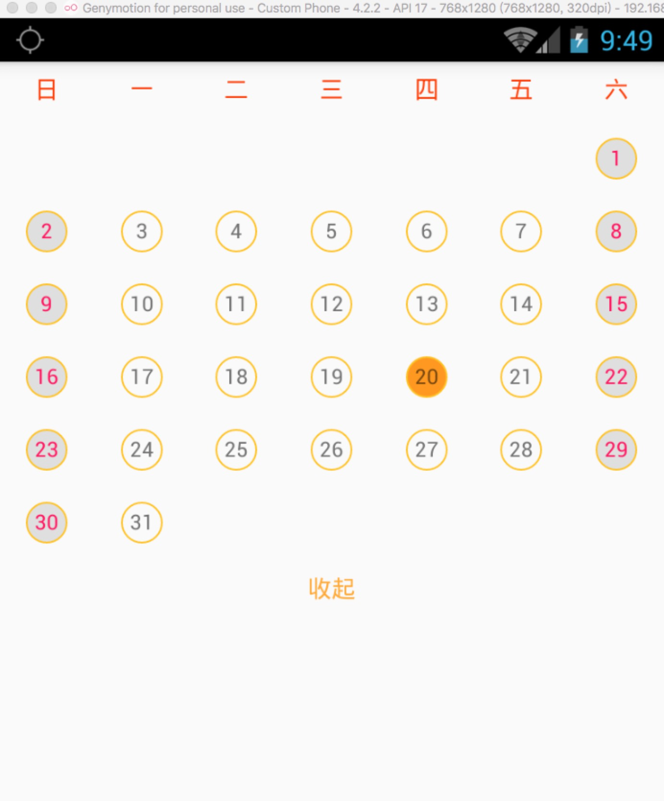

# Rn_CalendarView
---

[![NPM version][npm-image]][npm-url]
[![npm download][download-image]][download-url]

[npm-image]:https://github.com/wisn-mirror/Rn_CalendarView
[npm-url]:https://github.com/wisn-mirror/Rn_CalendarView
[download-image]: https://github.com/wisn-mirror/Rn_CalendarView
[download-url]: https://github.com/wisn-mirror/Rn_CalendarView

An extensible calendar component for react-native.

## Usage

```js
import CalendarView from "./CalendarView";

module.exports = React.createClass({
  render () {
    return (<CalendarView
                            year={2017}
                            month={9}
                            selectOnListener={(date) => {
                                Alert.alert("??", "????" + date);
                            }}
                        />);
  }
});
```

## Props

Property  | Description | Type | Default | note
----------|-------------|------|---------|------
year | year. | string | current year |
month | month. | string | current month |
selectOnListener | selected CallBack. | fun | null |
head | head of the calendar | array | `['S', 'M', 'T', 'W', 'T', 'F', 'S']` |

## Example

View [Rn_CalendarView](Rn_CalendarView).

### ScreenShot



## License

The MIT License
