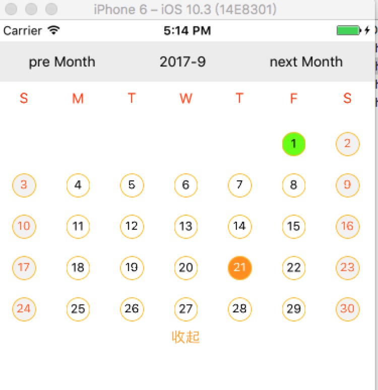
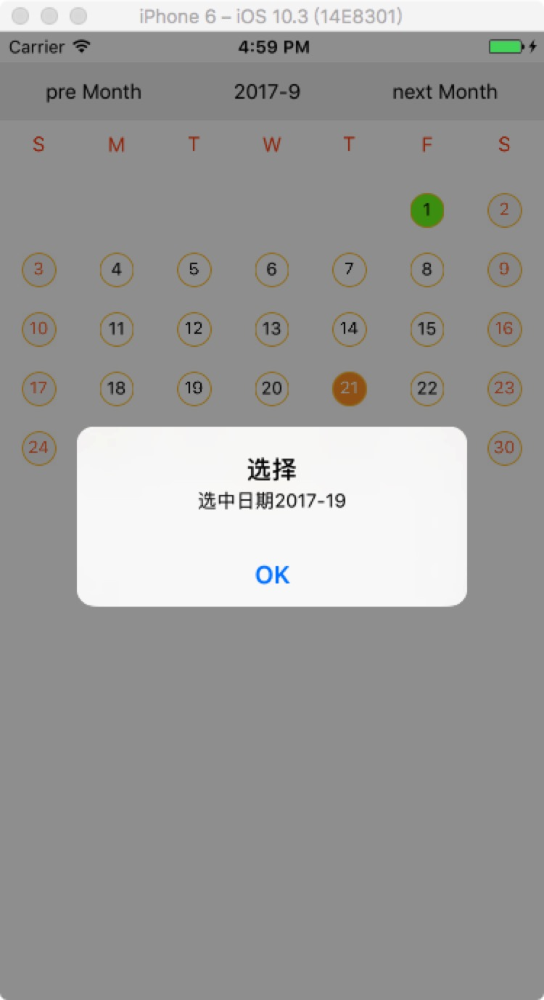
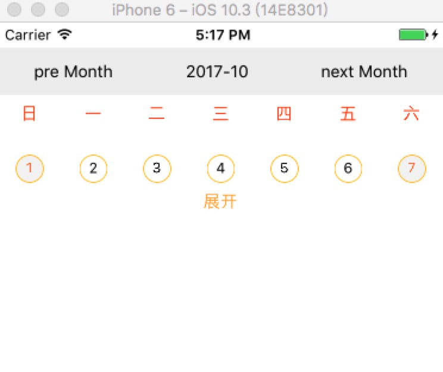
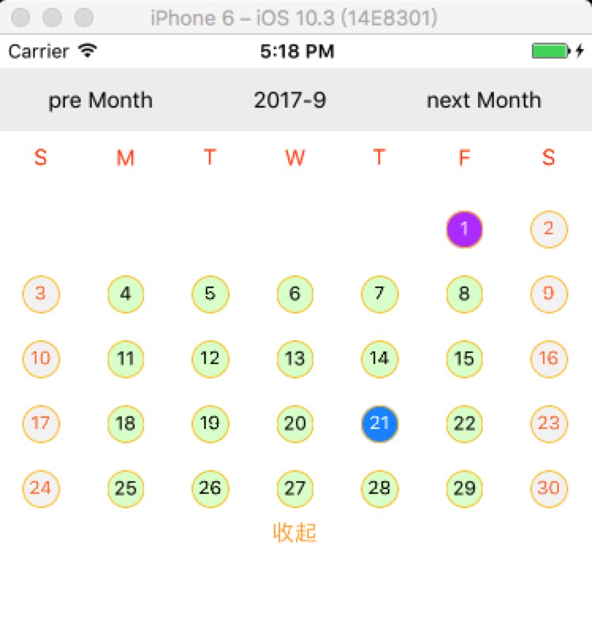
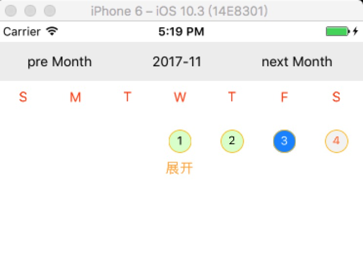
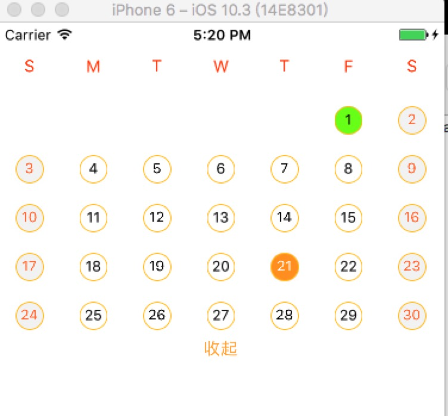

# Rn_CalendarView
[npm-image]:https://github.com/wisn-mirror/Rn_CalendarView
[npm-url]:https://github.com/wisn-mirror/Rn_CalendarView
[download-image]: https://github.com/wisn-mirror/Rn_CalendarView
[download-url]: https://github.com/wisn-mirror/Rn_CalendarView

An  calendar component for react-native.

## Usage

```js
import CalendarView from "./CalendarView";

module.exports = React.createClass({
    render () {
        return (<CalendarView
                    year={2017}
                    month={9}
                    isEN={true}
                    head={['S', 'M', 'T', 'W', 'T', 'F', 'S']}
                    isShowHeader={true}
                    selectDay={21}
                    selectOnListener={(year,date) => {
                    Alert.alert("选择", "选中日期" + year+"-"+date);
                }}
             />);
        }
});
```

## Props

Property  | Description | Type | Default | note
----------|-------------|------|---------|------
year | year.指定年 | string | current year |
month | month. 指定月| string | current month |
selectOnListener | selected CallBack.选中日期的回调 | fun | null |
isEN | isEnglish header 是否使用英文头部 | boolean | ['日', '一', '二', '三', '四', '五', '六']; |
head | head of the calendar  自定义星期的头部字体| array | `['S', 'M', 'T', 'W', 'T', 'F', 'S']` |
isShowHeader | show Header control 是否显示头部控制上个月，下个月 | boolean | true |
selectDay | set default select day 默认选中日期| number | -1 |
calendarStyle | set calendarStyle 设置日历的样式| View.propTypes.style | |
titleHeaderRowStyle | set titleHeaderRowStyle 设置头部行的样式| View.propTypes.style | |
titleHeaderStyle | set titleHeaderStyle 设置头部行中的字体的样式| View.propTypes.style | |
dayStyle | set dayStyle 设置日历每天字体的样式| View.propTypes.style | |
dayRowStyle | set dayRowStyle 设置日历天数行的样式| View.propTypes.style | |
selectDayStyle | set selectDayStyle 设置选中日期字体的样式| View.propTypes.style | |
currentDayStyle | set currentDayStyle 设置当天日期字体的样式| View.propTypes.style | |


### ScreenShot


## Usage

```js
import CalendarView from "./CalendarView";

module.exports = React.createClass({
    render () {
        return (<CalendarView
                    year={2017}
                    month={9}
                    isEN={true}
                    head={['S', 'M', 'T', 'W', 'T', 'F', 'S']}
                    isShowHeader={true}
                    selectDay={21}
                    selectOnListener={(year,date) => {
                    Alert.alert("选择", "选中日期" + year+"-"+date);
                }}
             />);
        }
});
```






## Usage

```js
import CalendarView from "./CalendarView";

module.exports = React.createClass({
    render () {
        return (<CalendarView
                    year={2017}
                    month={9}
                    isEN={true}
                    head={['S', 'M', 'T', 'W', 'T', 'F', 'S']}
                    isShowHeader={true}
                    selectDay={21}
                    selectOnListener={(year,date) => {
                    Alert.alert("选择", "选中日期" + year+"-"+date);
                    }}
                    currentDayStyle={{backgroundColor:"#b42fff",color:"white"}}
                    selectDayStyle={{backgroundColor:"#1c8bff",color:"white"}}
                    dayStyle={{backgroundColor:"#ddffd0",color:"#000"}}
             />);
        }
});
```





## Usage

```js
import CalendarView from "./CalendarView";
module.exports = React.createClass({
    render () {
        return (<CalendarView
                    year={2017}
                    month={9}
                    isEN={true}
                    isShowHeader={false}
                    selectDay={21}
                    selectOnListener={(year,date) => {
                    Alert.alert("选择", "选中日期" + year+"-"+date);
                }}
             />);
        }
});
```


## License

The MIT License
